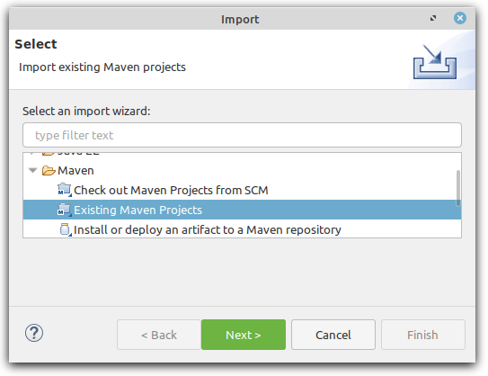
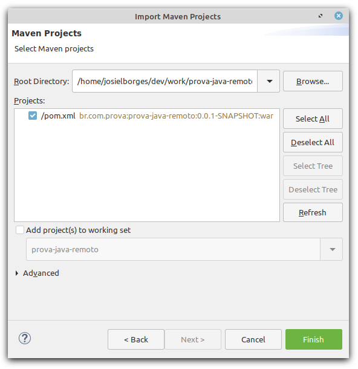
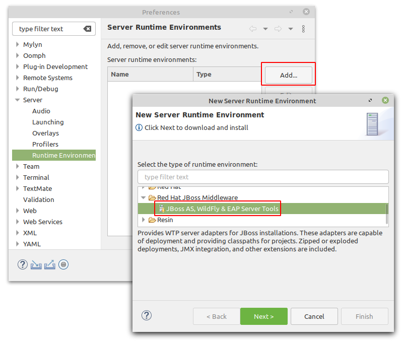
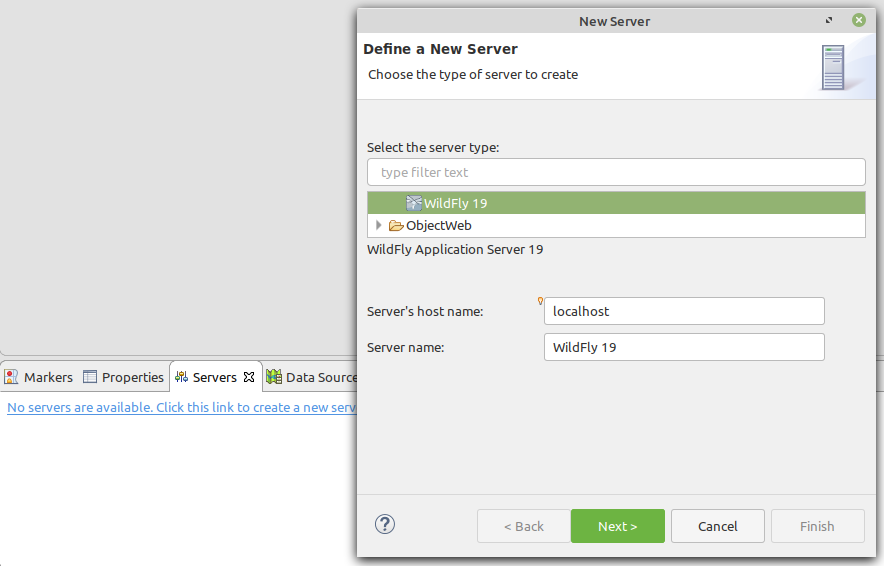
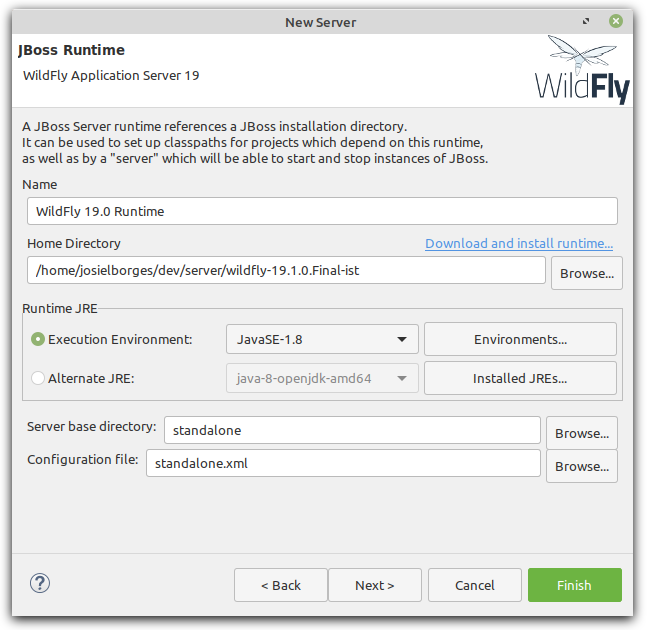
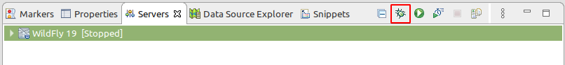
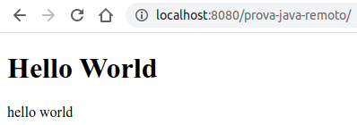

# Prova Java IST - Configuração

O desenvolvimento da prova consiste em desenvolver telas(s) conforme especificado, em protótipos enviados por e-mail.

O projeto da prova utiliza a linguagem JAVA EE (CDI, JPA, JSF, Managed Beans, etc).
A única lib extra que está configurada para utilização é o Primefaces.

Alguns pontos em relação ao desenvolvimento: 
- Fique a vontade para adicionar mais libs, caso ache necessário. No entanto, essas devem ser adicionada ao projeto via maven (no arquivo pom.xml)
- A criação das tabelas, no banco de dados, são de forma automática, dependendo do que está modelado nas entidades. 
- Os arquivos de exemplo, do hello world, estão todos numa pasta. No entanto, organize os arquivos do projeto de uma forma adequada (MVC).

No mais, desenvolva com qualidade e boa prova :)
## Versão JDK

Utilizar a versão mais recente.

## Download da IDE

Baixar e descompactar o Eclipse:

- [Windows][eclipse-windows]
- [Linux][eclipse-linux]
- [Mac][eclipse-mac]

Iniciar o Eclipse escolhendo uma worksplace de sua preferência.

## Download do Servidor de aplicação 

Fazer o download do servidor de aplicação (Wildfly) pré-configurado em [aqui][wildfly-link] e extrair em um local apropriado.

## Clone do repositório do projeto

Clonar esse repositório dentro da pasta do workspace utilizado no Eclipse.

## Clone do repositório do banco de dados

Instalar o docker: https://www.docker.com/get-started > Docker Desktop

O banco de dados é criado via docker e o fonte está disponível em https://github.com/CETEC-DIGI/prova-java-remoto-banco

Apos o clone, ir via terminal na pasta extraida e executar o banco pelo docker: `docker-compose up -d`

OBS: Se atentar que não pode haver nenhum servidor postgres rodando na máquina, se tiver, necessário fechar todos os serviços, assim como
qualquer outro serviço que esteja utilizando a porta 5432. Para verificar se o docker subiu corretamente, realizar a conexão com o banco:
- host: localhost
- port: 5432
- database: ist
- user: ist
- password: ist

## Configuração da IDE

- Ir em "File > Import..." e escolher a opção conforme segue:

  

- Selecionar a pasta do projeto e confirmar como segue:

  

- Em *Select root repository* escolher a pasta do projeto e clicar em *Finish*.
- Ir no menu "Window > Preferences" e Adicionar um novo *Runtime Environment* conforme segue:

  

  - Nesse momento será feito o download dos arquivos necessários para que o *Ecplise* consiga usar o servidor de aplicação Wildfly.
  - A instalação será feita em segundo plano (verificar barra de status).
  - Confirmar, caso haja, alguma tela de confirmação e reiniciar o *Eclipse ao final do processo*.

- Na aba "Servers" clicar em *No server are available. Click this link to create a new server...* como segue:

  

- Na etapa de criação do servidor, selecionar a pasta do servidor baixado anteriormente. Como por exemplo:

  
  
- Na próxima etapa, adicionar o projeto ficando dessa forma:
  
  

- Finalizar em *Finish*.

- Subir o servidor em modo *Debug* no botão à seguir:

  

- No navegador digitar http://localhost:8080/prova-java-remoto/, irá mostrar uma tela inicial com **Hello Word**:

  

[eclipse-windows]: https://www.eclipse.org/downloads/download.php?file=/technology/epp/downloads/release/2020-03/R/eclipse-jee-2020-03-R-incubation-win32-x86_64.zip

[eclipse-linux]: https://www.eclipse.org/downloads/download.php?file=/technology/epp/downloads/release/2020-03/R/eclipse-jee-2020-03-R-incubation-linux-gtk-x86_64.tar.gz

[eclipse-mac]: https://www.eclipse.org/downloads/download.php?file=/technology/epp/downloads/release/2020-03/R/eclipse-jee-2020-03-R-incubation-macosx-cocoa-x86_64.dmg

[wildfly-link]: https://drive.google.com/file/d/1WRJBBxvkAhN5iAN72j6CSCs8Lgk0iQn7/view?usp=sharing
